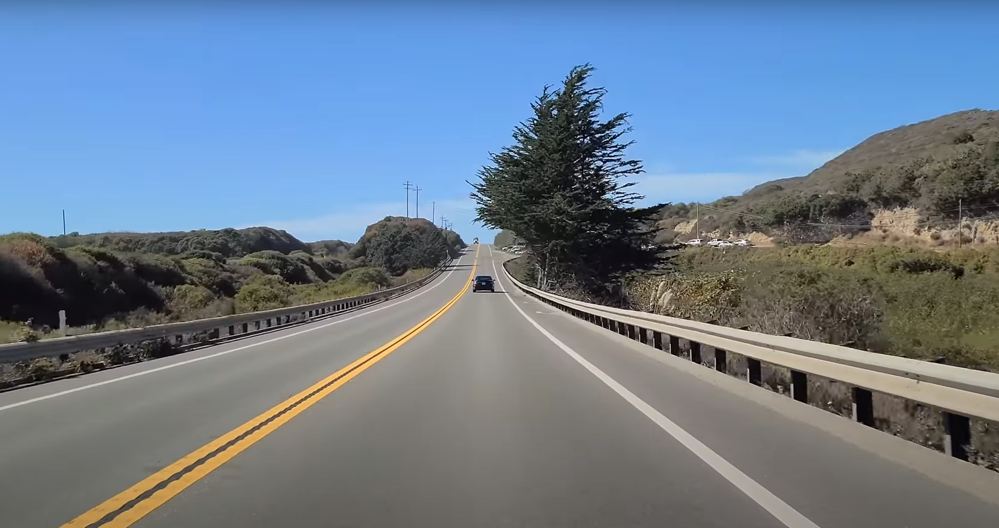
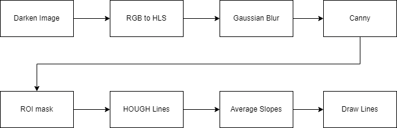

# DAS (Driving Assistant System)

- `🟢` Lane Detection 
- `🟠` Warning if leaving the lane 
- `🔴` Car detection 
- `🔴` Warning if getting too close to other cars 
- `🔴` C++ rewrite 

## Lane Detection 

<h2> Lane Detection Pipeline </h2>

[Notebook](./Lane_Detection/lane_detection.ipynb) / [Pipeline Implementation](./Lane_Detection/opt_image_processing.py)
